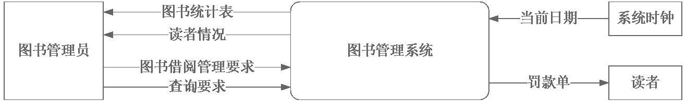
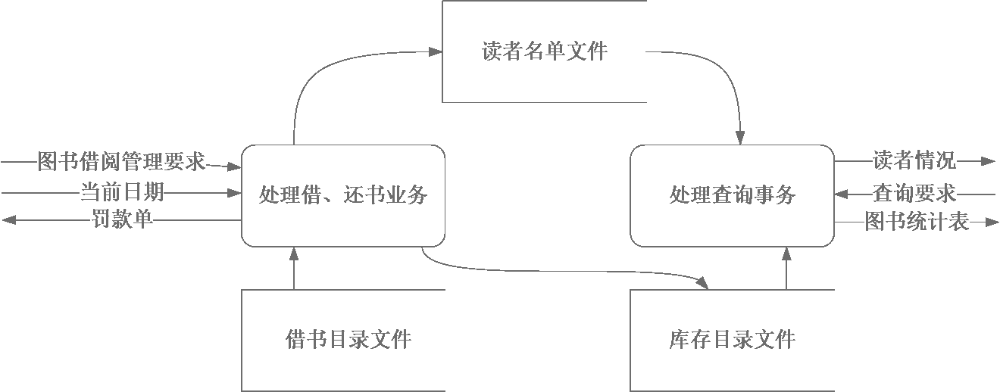
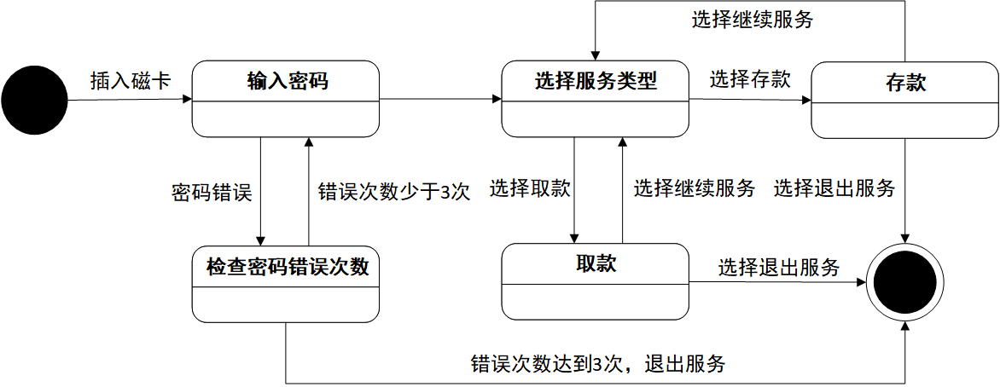
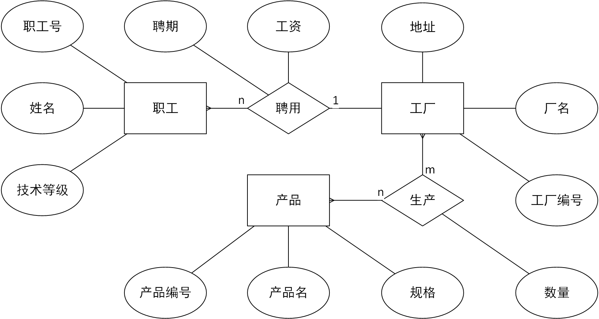

# 第4章&emsp;结构化分析

<!-- omit in toc -->
## 目录

- [1. 选择题](#1-选择题)
- [2. 判断题](#2-判断题)
- [3. 简答题](#3-简答题)
- [4. 应用题](#4-应用题)

## 1. 选择题

1. 在需求分析之前有必要进行（ B ）工作。
   - [ ] A. 程序设计
   - [X] B. 可行性研究
   - [ ] C. E-R分析
   - [ ] D. 行为建模

2. 需求分析是一个（ D ），他应该贯穿于系统的整个生命周期，而不是仅仅属于软件生命周期早期的一项工作。
   - [ ] A. 概念
   - [ ] B. 工具
   - [ ] C. 方法
   - [X] D. 过程

3. 软件需求规格说明书的内容不应该包括（ D ）。
   - [ ] A. 对重要功能的描述
   - [ ] B. 对算法的详细过程描述
   - [ ] C. 对数据的要求
   - [X] D. 软件的性能

4. 软件需求分析阶段的工作，可以分为以下4个方面：对问题的识别、分析与综合、编写需求分析文档以及（ C ）。
   - [ ] A. 总结
   - [ ] B. 阶段性报告
   - [X] C. 需求分析评审
   - [ ] D. 以上答案都不正确

5. 进行需求分析可使用多种工具，但（ B ）是不适用的。
   - [ ] A. 数据流图
   - [X] B. PAD 图
   - [ ] C. 状态转换图
   - [ ] D. 数据词典

6. 数据流图是进行软件需求分析的常用图形工具，其基本图形符号是（ C ）。
   - [ ] A. 输入、输出、外部实体和加工
   - [ ] B. 变换、建安工、数据流和存储
   - [X] C. 加工、数据流、数据存储和外部实体
   - [ ] D. 变换、数据存储、加工和数据流

7. 结构化分析方法的基本思想是（ B ）。
   - [ ] A. 自底向上逐步分解
   - [X] B. 自顶向下逐步分解
   - [ ] C. 自底向上逐步抽象
   - [ ] D. 自顶向下逐步抽象

8. 在 E-R 图中，包含以下基本成分（ D ）。
   - [ ] A. 数据、对象、实体
   - [ ] B. 控制、关系、对象
   - [ ] C. 实体、关系、控制
   - [X] D. 实体、属性、关系

## 2. 判断题

|  选项   | 题目                                                                                       |
| :-----: | :----------------------------------------------------------------------------------------- |
| （ √ ） | 用于需求分析的软件，应该能够保证需求的正确性，即验证需求的一致性、完整性、现实性和有效性。 |
| （ × ） | 需求分析是开发方的工作，用户的参与度不大。                                                 |
| （ × ） | 需求规格说明书在软件开发中具有重要的作用，它也可以作为软件可行性研究的依据。               |
| （ √ ） | 需求分析的主要目的是解决软件开发的具体方案。                                               |
| （ √ ） | 需求规格说明书描述了系统每个功能的具体实现。                                               |
| （ √ ） | 非功能需求是从各个角度对系统的约束和限制，反映了应用对系统质量和特性的额外要求。           |
| （ × ） | 需求分析阶段的成国主要是需求规格说明书，但该成果与软件设计、编码、测试直至维护关系不大。   |
| （ × ） | 分层的 DFD 图可以用于可行性研究阶段，描述系统的物理结构。                                  |
| （ √ ） | 信息建模方法是从数据的角度来建立信息模型的，最常用的描述信息模型的方法是 E-R 图。          |
| （ × ） | 在需求分析阶段主要采用图形工具来描述的原因是信息量大，便于描述大规模的软件系统。           |
| （ × ） | 设计数据流图时只需考虑系统必须完成的基本逻辑功能，完全不需要考虑怎样具体地实现这些功能。   |

## 3. 简答题

1. 如何理解需求分析地作用和重要性。
   > &emsp;&emsp;一般情况下，用户并不熟悉计算机的相关知识，而软件开发人员对相关的业务领域也不甚了解，用户与开发人员之间对同一问题理解的差异和习惯用语不同往往会为需求分析带来很大的困难。所以，开发人员和用户之间充分和有效的沟通在需求分析的过程中至关重要。

2. 常用的需求获取的方法有哪些？对比各种方法的优缺点。
   > &emsp;&emsp;获取需求的方法有很多种比如：
   >
   > - 问卷调查
   >
   >   &emsp;&emsp;问卷调查法是采用调查问卷的形式来进行需求分析的一种方法。通过对用户填写的调查问卷进行汇总、统计和分析，开发人员便可以得到一些有用的信息。
   >
   >   &emsp;&emsp;调查问卷中的开放式问题回答不受限制、自由灵活，能够激发用户思维，使他们能尽可能地阐述自己的真实想法。但是，对开放式问题进行汇总和分析的工作会比较复杂。
   >
   >   &emsp;&emsp;封闭式问题的答案使预先设定的，用户从若干答案中进行选择。它便于对问卷信息进行归纳与整理，但是会限制用户的思维。
   >
   > - 访谈
   >
   >   &emsp;&emsp;访谈通过开发人员与特定的用户代表进行座谈，进而了解到用户的意见，是最直接的需求获取方法。
   >
   >   &emsp;&emsp;由于被访谈的用户身份可能多种多样，开发人员要根据用户的身份特点进行提问、予以启发。当然进行详细地记录也是访谈过程中必不可少的工作。
   >
   > - 亲身实践
   >
   >   &emsp;&emsp;亲身实践可以更直接地体会现有系统地弊端以及新系统应该解决的问题，这种需求获取方法就是实地操作。通过实地操作得到的信息会更加准确和真实，但是这种方法会比较费时间。
   >
   > - 建立原型系统
   >
   >   &emsp;&emsp;当用户本身对需求的了解不太清晰的时候，开发人员通常采用建立原型系统的方法对用户需求进行挖掘。通过对原型系统进行模拟操作，开发人员能及时获得用户的一键，从而对需求进行明确。

3. 如何理解结构化需求分析方法的基本思想？
   > &emsp;&emsp;结构化需求分析是一种面向数据流的需求分析方法。它基于 “分解” 和 “抽象” 的基本思想。逐步建立目标系统的逻辑模型，进而描绘出满足用户要求的软件系统。
   >
   > &emsp;&emsp; “分解” 是指对于一个复杂的系统为了将复杂性降低到可以掌握的程度，可以把大问题分解为若干个小问题，然后再分别解决。最顶层描述了整个目标系统，中间层将目标系统划分为若干个模块，每个模块完成一定的功能，而最底层是对每个模块实现方法的细节性描述。
   >
   > &emsp;&emsp;可见，在逐层分解的过程中，起初并不考虑细节性的问题，而是先关注问题最本质的属性，随着分解自顶向下进行，才逐渐考虑越来越具体的细节。这种用最本质的属性表示一个软件的方法就是 “抽象” 。

4. 简述数据流图的作用。
   > &emsp;&emsp;指出当数据在软件系统中移动时怎样被变换，并描绘数据流的功能及其子功能。

5. 简述数据字典的作用。
   > &emsp;&emsp;为了描述在结构化分析过程中定义对象的内容，用于描述数据的信息。定义系统中使用的所有数据元素，用系统化的方式来表示每个数据对象和控制信息的特质。

6. 简述 E-R 图的作用。
   > &emsp;&emsp;它提供了表示实体类型、属性和联系的方法，用于描述现实世界的概念模型。它时描述现实世界关系概念的有效方法，时表示概念关系模型的一种方式。

7. 简述状态图的作用。
   > - 清晰地描述了状态之间的转换顺序，通过状态的转换顺序也就可以清楚地看出时间的执行顺序。
   > - 有利于程序员在开发程序时避免出现时间顺序错误的情况。
   > - 清晰地描述了状态转换时所必须的触发事件、监护条件和动作等影响转换的因素，有利于程序猿避免程序中非法事件的进入
   > - 通过判定可以更好地描述工作流因为不同的条件发生的分支。

## 4. 应用题

1. 某图书管理系统具有以下功能。

   1. 借书。输入读者借书证，系统首先检查借书证是否有效，若有效，对于第一次借书的读者，在借书文档上建立档案，否则查阅借书文件，检查该读者所借图书是否超过10本，若已达10本，拒借，未达10本办理借书（检查该读者借书目录并将结束情况登入借书文件）。
   2. 还书。从借书文件中读出与读者有关的记录，查阅所借日期，如果超期（3个月），就做触发处理，否则修改库存目录与借书文件。
   3. 查询。可通过借书文件、库存目录文件查询读者情况、图书借阅情况及库存情况，打印各种统计表。

   &emsp;&emsp;用结构化分析方法画出系统顶层图、0层图（数据流图），并写出数据字典。

   > 系统0层图：
   >
   > 
   >
   > 0层图：
   >
   > 
   >
   > 数据字典：
   >
   > - $\text{借书文件}=\left\{\text{读者证号}+\text{有效性}+\text{借书数量}+\left\{\text{借书情况}+\text{所借日期}\right\}\right\}$
   > - $\text{库存目录文件}=\left\{名称+借阅情况+库存数量\right\}$

2. 根据以下描述画出相应的状态转换图。

   &emsp;&emsp;到 ATM 前插入磁卡后输入密码，如果密码不正确则系统会要求再次输入密码，如3次输入不正确，则退出服务。密码正确后，系统会提示选择服务类型，如果选择存款，则进行存款操作，存款完毕后可选择继续服务，也可以选择退出服务。如果选择取款，则进行取款操作，取款完毕后可选择继续服务，也可以选择退出服务。

   > 状态转换图：
   >
   > 

3. 某企业集团有若干工厂，每个工厂生产多种产品，且每一种产品可以在多个工厂生产，每个工厂按照固定的计划数量生产产品，计划数量不低于300；每个工厂聘用多名职工，且每名职工只能在一个工厂工作，工厂聘用职工有聘期和工资。工厂的属性有工厂编号、厂名、地址，产品的属性有产品编号、产品名、规格，职工的属性有职工号、姓名、技术等级。请画出 E-R 图。
   > E-R 图：
   >
   > 
